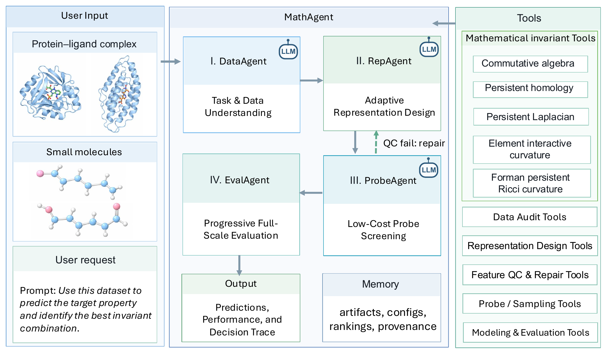
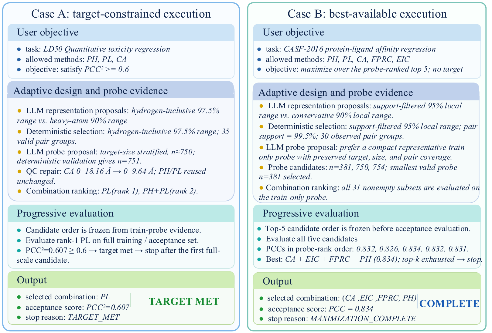

# MathAgent

**An Agentic Framework for Adaptive Mathematical Representation Selection in Molecular Modeling**

MathAgent is a LangGraph-oriented scientific agent that turns a user request,
dataset manifest, and existing mathematical invariant tools into an auditable
representation-search workflow. It supports protein-ligand binding affinity and
quantitative small-molecule toxicity tasks, while keeping scientific decisions
grounded in deterministic Python validation, cached feature artifacts, and
explicit train/test boundaries.



> **DataAgent** parses the user objective and validates dataset structure;
> **RepAgent** proposes and validates adaptive representation settings;
> **ProbeAgent** screens method combinations on a representative train-only
> probe; **EvalAgent** progressively evaluates full-scale candidates and stops
> according to the user-specified mode.

---

## Table of Contents

- [Project Rationale](#project-rationale)
- [Workflow at a Glance](#workflow-at-a-glance)
- [Mathematical Tool Layer](#mathematical-tool-layer)
- [Execution Policies](#execution-policies)
- [Installation](#installation)
- [Quick Start](#quick-start)
- [Experiment Reproduction](#experiment-reproduction)
- [Current Validation Status](#current-validation-status)
- [Repository Layout](#repository-layout)
- [Security and Data Policy](#security-and-data-policy)

---

## Project Rationale

Mathematical molecular representations such as persistent homology, persistent
Laplacian, commutative algebra descriptors, and curvature summaries can capture
different structural signals. In practice, however, the useful representation is
dataset-, task-, split-, and model-dependent.

MathAgent is designed for this setting:

- users can specify the prediction task, allowed methods, metric, split, and
  stopping goal;
- LLMs can propose representation and probe strategies, but cannot override
  deterministic validation;
- feature tools are treated as isolated scientific tools rather than rewritten
  inside the agent;
- probe screening is used to reduce expensive full-scale evaluation;
- every generated config, feature artifact, ranking, and final report is
  traceable.

The repository intentionally does not include raw datasets, generated feature
matrices, private API keys, Slurm logs, or experiment caches.

## Workflow at a Glance

MathAgent follows a four-stage agentic workflow:

| Stage | Agent role | Main evidence produced |
|-------|------------|------------------------|
| **Task and data understanding** | Parse natural language or YAML; validate task type, metric, dataset manifest, label availability, split, and user constraints. | Structured request, task config, preflight report. |
| **Adaptive representation design** | Summarize train-only molecular statistics; generate bounded representation candidates; validate element/channel support and filtration settings. | Frozen representation specs and representation advisory record. |
| **Probe-based screening** | Select a representative train-only probe; compute requested invariant blocks; run probe GBT/CV; rank method combinations with QC and stability checks. | Probe selection, feature QC, probe rankings, promoted candidates. |
| **Progressive evaluation** | Reuse cached full-scale feature blocks; evaluate frozen promoted candidates; stop on target satisfaction or complete the best-available pool. | Final metrics, selected combination, stopping reason, decision trace. |

LLM use is optional and bounded. In advisory mode, the LLM may propose adaptive
settings or probe strategies, but Python validators decide whether those
proposals are allowed. The final ranking is empirical: feature QC first, probe
performance next, stability for close candidates, and computational cost as a
late tie-breaker.

## Mathematical Tool Layer

MathAgent wraps existing mathematical feature implementations through explicit
tool adapters. The currently supported invariant families are:

| Code | Representation family | Typical role |
|------|------------------------|--------------|
| `PH` | Persistent homology summaries | Multiscale connected-component and loop information. |
| `PL` | Persistent Laplacian summaries | Topological-spectral structural information. |
| `CA` | Commutative algebra / facet-vector summaries | Algebraic and combinatorial molecular structure. |
| `FPRC` | Forman persistent Ricci curvature summaries | Multiscale discrete curvature information. |
| `EIC` | Element-interactive curvature summaries | Element-resolved geometric/curvature information. |

The repository also contains supporting tools for:

- dataset audit and manifest validation;
- adaptive element/channel and filtration design;
- representative probe selection;
- feature QC and filtration repair;
- GBT training and evaluation;
- artifact caching and provenance reporting.

## Execution Policies

MathAgent can run in a target-constrained mode or a best-available mode. The
figure below shows two example decision traces using the same workflow logic.



- **Target-constrained mode:** stop after the first full-scale candidate that
  reaches the user-specified target.
- **Best-available mode:** evaluate the frozen promoted top-k candidate pool and
  return the best candidate under the selected protocol.

Both modes freeze candidate order before full-scale evaluation and preserve the
train/test information boundary.

## Installation

Use Python 3.10 or newer.

```bash
git clone https://github.com/yren24/MathAgent.git
cd MathAgent
python -m pip install -e ".[dev]"
```

Optional extras:

```bash
python -m pip install -e ".[dev,agent]"     # LangGraph support
python -m pip install -e ".[dev,datasets]"  # optional dataset readers
python -m pip install -e ".[dev,ann]"       # optional ANN diagnostics
```

For HPC use, start from the generic execution profile and adapt it to your
cluster:

```text
configs/execution/template_hpc.yaml
scripts/slurm/
```

Site-specific profiles such as `configs/execution/sapelo2.yaml` are examples,
not requirements. Users on other clusters should copy `template_hpc.yaml`, edit
paths/modules/partitions, and keep their local profile out of version control if
it contains private paths.

## API Keys

LLM features are optional. Copy the example and fill it locally:

```bash
cp .env.example .env
```

or use a user-level file:

```bash
mkdir -p ~/.config/mathagent
cp .env.example ~/.config/mathagent/openai.env
```

Do not commit real credentials.

## Quick Start

### 1. Structured YAML request

```bash
mathagent start \
  --request configs/requests/generic_protein_ligand.example.yaml \
  --output-dir runs/intake/my-run
```

Add `--execute` to submit the resolved workflow through the configured Slurm
profile:

```bash
mathagent start \
  --request configs/requests/generic_protein_ligand.example.yaml \
  --output-dir runs/intake/my-run \
  --execute
```

### 2. Natural-language intake

```bash
export OPENAI_API_KEY="..."
export OPENAI_MODEL="gpt-5.6-terra"

mathagent start \
  --prompt-file /path/to/user_prompt.txt \
  --model "$OPENAI_MODEL" \
  --execution-profile configs/execution/template_hpc.yaml \
  --manifest-path /path/to/data/manifest.csv \
  --output-dir runs/intake/natural-request
```

To enable LLM scientific advisory for representation/probe strategy:

```bash
mathagent start \
  --prompt-file /path/to/user_prompt.txt \
  --model "$OPENAI_MODEL" \
  --llm-scientific-mode advisory \
  --llm-scientific-model "$OPENAI_MODEL" \
  --llm-scientific-env-file ~/.config/mathagent/openai.env \
  --execution-profile configs/execution/template_hpc.yaml \
  --manifest-path /path/to/data/manifest.csv \
  --output-dir runs/intake/natural-request \
  --execute
```

### 3. Direct pipeline launcher

```bash
mathagent plan --config configs/pipelines/generic_protein_ligand.example.yaml
mathagent submit --config configs/pipelines/generic_protein_ligand.example.yaml --execute
mathagent status --config configs/pipelines/generic_protein_ligand.example.yaml
mathagent resume --config configs/pipelines/generic_protein_ligand.example.yaml --execute
mathagent report --config configs/pipelines/generic_protein_ligand.example.yaml
```

Equivalent module entry point:

```bash
python -m mint_scout.run_pipeline status \
  --config configs/pipelines/generic_protein_ligand.example.yaml
```

### 4. Generic Slurm/HPC execution

Edit a cluster execution profile first:

- `paths.project_root`;
- `paths.scratch_root`;
- `tools.plbind_root`;
- module setup, partition, memory, CPU, and time limits.

For most clusters, use the generic pipeline command:

```bash
mathagent submit \
  --config configs/pipelines/generic_protein_ligand.example.yaml \
  --execute
```

The login or submit node should only start and inspect the workflow. Dataset
preparation, feature generation, QC, probe evaluation, and final GBT evaluation
should run as compute jobs.

The `scripts/sapelo2/` directory is a site-specific example profile. It is
useful as a template for Sapelo2 users, but it is not needed for users on other
HPC systems.

## Experiment Reproduction

For a clone-to-run checklist, see [REPRODUCE.md](REPRODUCE.md).

At a high level:

| Goal | Needs |
|------|-------|
| Run request parsing and planning | Code install only. |
| Run natural-language intake | Code install plus an LLM API key. |
| Run protein-ligand workflows | Dataset manifest, structure files, labels, execution profile, and external `embed_nn/plbind` tools. |
| Run toxicity workflows | Molecule manifest, molecule files, labels, execution profile, and external toxicity feature tools. |
| Reproduce paper-scale experiments | The above plus benchmark datasets and cluster compute. |

## Current Validation Status

The public repository contains the workflow code and configuration templates,
not the private datasets or generated artifacts. The following parts are
expected to work directly after installation:

- Python package import and CLI entry points;
- request validation and config generation;
- deterministic pipeline planning;
- Slurm job-plan construction;
- unit tests that use synthetic fixtures.

The following parts require user-supplied external inputs:

- full protein-ligand feature generation requires structure files, labels, and
  the external `embed_nn/plbind` feature-tool directory;
- full toxicity feature generation requires molecule files, labels, and the
  corresponding external legacy feature implementation;
- LLM intake or advisory requires a user-provided API key through the local
  environment.

In other words, MathAgent is a runnable workflow framework, but the full
scientific runs are intentionally not self-contained because the datasets,
legacy feature tools, cluster paths, and API credentials are user-specific.

## Repository Layout

```text
MathAgent/
├── README.md
├── REPRODUCE.md
├── pyproject.toml
├── figures/                  Paper-style framework and workflow figures
├── configs/                  Request, task, representation, GBT, and HPC configs
├── scripts/
│   ├── slurm/                Generic Slurm wrappers
│   ├── sapelo2/              Optional site-specific launcher examples
│   └── diagnostics/          Offline comparison helpers
├── src/mint_scout/           Core Python package
│   ├── agent/                LLM intake, advisory, explanation, graph helpers
│   ├── data/                 Dataset manifests, splits, geometry, preparation
│   ├── execution/            Artifact registry, Slurm jobs, lifecycle engine
│   ├── invariants/           Legacy mathematical feature tool adapters
│   ├── models/               GBT and optional ANN utilities
│   ├── scout/                Probe CV, ranking, target policy
│   ├── toxicity/             Small-molecule toxicity workflow
│   └── mof/                  Experimental MOF workflow utilities
└── tests/                    Unit and workflow tests
```

### LangGraph / workflow mapping

The package keeps the historical internal module name `mint_scout`. The public
CLI is `mathagent`; the legacy CLI alias `mint-agent` is also retained.

| Workflow concept | Representative code |
|------------------|---------------------|
| User request parsing | `src/mint_scout/user_intake.py`, `src/mint_scout/agent/llm_intake.py` |
| LLM scientific advisory | `src/mint_scout/agent/llm_scientific.py`, `src/mint_scout/toxicity/advisory.py` |
| Representation design | `src/mint_scout/design_representation.py`, `src/mint_scout/representation_design.py` |
| Probe selection and audit | `src/mint_scout/select_casf_probe.py`, `src/mint_scout/probe_audit.py` |
| Feature tools and QC | `src/mint_scout/invariants/`, `src/mint_scout/feature_qc.py`, `src/mint_scout/filtration_audit.py` |
| Progressive evaluation | `src/mint_scout/evaluate_acceptance_gbt.py`, `src/mint_scout/evaluate_frozen_test_gbt.py` |
| Slurm orchestration | `src/mint_scout/run_pipeline.py`, `src/mint_scout/execution/` |

## Tests

```bash
python -m compileall src
pytest
```

Some tests use synthetic fixtures only. Full HPC tests require configured data,
external feature tools, and a Slurm execution profile.

## Security and Data Policy

- Raw datasets, generated features, caches, logs, and run artifacts are excluded.
- `.env`, `*.env`, and local credential files are ignored.
- Example paths are placeholders and must be edited for each machine.
- External legacy feature tools are referenced through user-configurable paths.
- Generated reports preserve hashes, frozen config paths, and provenance records
  for auditability.
